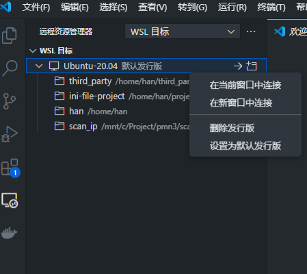
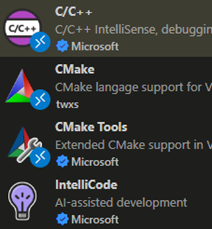
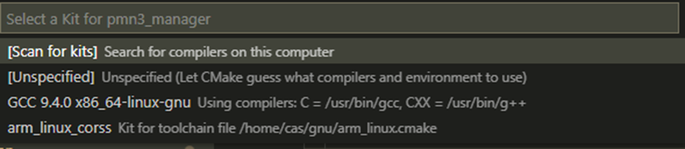
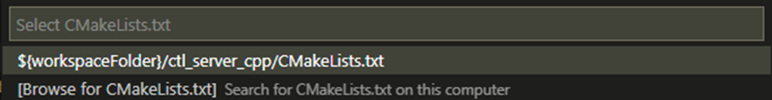
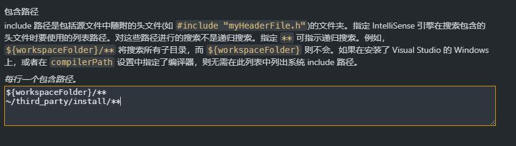

# 基于WSL的交叉编译环境搭建

  以ini文件读写工具为例，介绍如何在WSL2中搭建交叉编译环墋，使用VSCode进行编译调试。

## 环境搭建与编译

* 一、安装WSL2:
  - 参考链接：[https://docs.microsoft.com/zh-cn/windows/wsl/install-win10](https://docs.microsoft.com/zh-cn/windows/wsl/install-win10)  
  - 系统要求：Windows 10 1903版本以上或Windows 11 专业版；
  - 安装主要步骤： 
    - 1、启用WSL并安装Linux发行版：  
      - 1.1、以管理员身份打开PowerShell，运行以下命令：
          ```powershell
            wsl --install -d Ubuntu-22.04
          ```
      - 1.2、重启计算机；
    - 2、启动WSL：  
      - 2.1、在PowerShell中运行以下命令：  `wsl`
      - 2.2、根据提示设置用户名和密码；
<br>


* 二、在Ubuntu中安装编译器与cmake:  
  ```bash
    sudo apt update && sudo apt install -y build-essential cmake ninja-build
  ```
<br>

* 三、安装vscode，并在插件商店中安装WSL插件，通过WSL插件连接到WSL2中的Ubuntu系统，右击发行版选择`在当前窗口打开`。

    

    打开后，安装插件：  
       

    安装完插件后，重启VSCode。
<br><br>  

* 四、将gnu、third_party、以及提供的实例工程project拷贝至任意目录，推荐拷贝至家目录下，然后给于文件权限。

    ```bash
      chmod -R 777 gnu third_party project
    ```
  
<br>

* 五、打开gnu/arm_linux.cmake，在`gnu/aarch32/`前面加入当前路径，例如：  

    ```cmake
      set(CMAKE_C_COMPILER /home/cas/gnu/aarch32/lin/gcc-arm-linux-gnueabi/bin/arm-linux-gnueabihf-gcc)
      
      set(CMAKE_CXX_COMPILER /home/cas/gnu/aarch32/lin/gcc-arm-linux-gnueabi/bin/arm-linux-gnueabihf-g++)  
    ```

    若需要添加第三方库，需设置`CMAKE_PREFIX_PATH`, `CMAKE_INCLUDE_PATH`, `CMAKE_LIBRARY_PATH`等路径。请参考`gnu/arm_linux.cmake`中的注释，注意路径的正确性：

    ```cmake
      set(CMAKE_PREFIX_PATH  ${CMAKE_PREFIX_PATH} /home/han/third_party/install)

      set(CMAKE_INCLUDE_PATH ${CMAKE_INCLUDE_PATH} /home/han/third_party/install/include)

      set(CMAKE_LIBRARY_PATH ${CMAKE_LIBRARY_PATH} /home/han/third_party/install/lib)

      include_directories(${CMAKE_INCLUDE_PATH})
    ```

  
    - 对于第三方库的交叉编译，需要将第三方库源码下载到`third_party/src`目录下。<br>

    - 对于提供CMakelists.txt的第三方库，请使用以上修改的工具链进行编译，本工程提供了编译脚本`cmake_build_install.sh`, 请修改脚本中的`CMAKE_TOOLCHAIN_FILE`为`gnu/arm_linux.cmake`所在路径，运行脚本即可编译安装

    - 对于没有提供`CMakeLists.txt`的第三方库，需要指定其编译工具为交叉编译工具，且编译后的安装目录为`third_party/install`
<br><br>

* 五、在vscode中打开工程目录，按`F1`，输入`CMAKE`选择`CMAKE:Configure`，`select_kit`选择`unspecified`。 

      

  `selet_cmakelist`选择`{workspacefolder}/cmakelist.txt` 

      

<br>

* 六、 按`F1`，输入`CMAKE`选择`CMAKE:Edit User-Local CMAKE Kits`， 在`[ ]` 加入以下语句:  
   ```json
      {
        "name": "arm_linux_corss",
        "toolchainFile": "/home/cas/gnu/arm_linux.cmake"
      }
    ```

  在前一个大括号前加`,`，如下：  
  
  ```json
    [
      {
        "name": "GCC 9.4.0 x86_64-linux-gnu",
        "compilers": {
          "C": "/usr/bin/gcc",
          "CXX": "/usr/bin/g++"
        },
        "isTrusted": true
      },
      {
        "name": "arm_linux_corss_compiler",
        "toolchainFile": "/home/cas/gnu/arm_linux.cmake",
        "isTrusted": true
      }
    ]
  ```

  其中`toolchainFile`：后面要指向`arm_linux.cmake`所在路径。  
  <br>


* 七、提供示例cmakelist.txt文件，可根据实际情况修改，具体内容请参考`cmakelist.txt`文件中的注释，要

  添加第三方库请使用`find_library`和`target_link_libraries`命令，示例代码如下：
  ```cmake
    find_library(THIRD_PARTY_LIB third_party)
    target_link_libraries(${PROJECT_NAME} ${THIRD_PARTY_LIB})
  ```
  第三方库的头文件路径已在编译工具链`arm_linux.cmake`中设置`include_directories(${CMAKE_INCLUDE_PATH})`，无需再次设置。

  要想在VSCode中可以找到第三方库的头文件，可按`F1`，输入`C/C++:编辑配置UI`，在`includePath`中加入第三方库的头文件路径，如图：
  

  
* 八、打开`cmakelist.txt`，按`ctl+s`保存，会自动生成`build`文件夹。在界面最底部有`cmake工具栏`，若没有，请按`F1`，输入`CMAKE`选择`CMAKE:Open CMake Tools Extension Settings`，在`Cmake>Options:Status bar visibility`中选择`visible`。
如图：

    

  点击`No activate kit`，选择`arm_linux_cross`；点击做左侧CMake:[Debug]:Ready，选择需要的编译模式，如`Debug`或`Release`，`CmakeList.txt`中设置的编译优化选项只对指定的模式有效。之后按`F7`或点击`build`开始编译,编译的二进制文件在`build/bin`中。